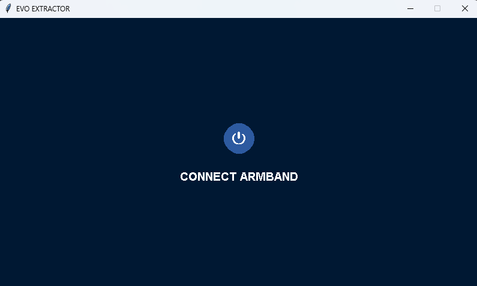
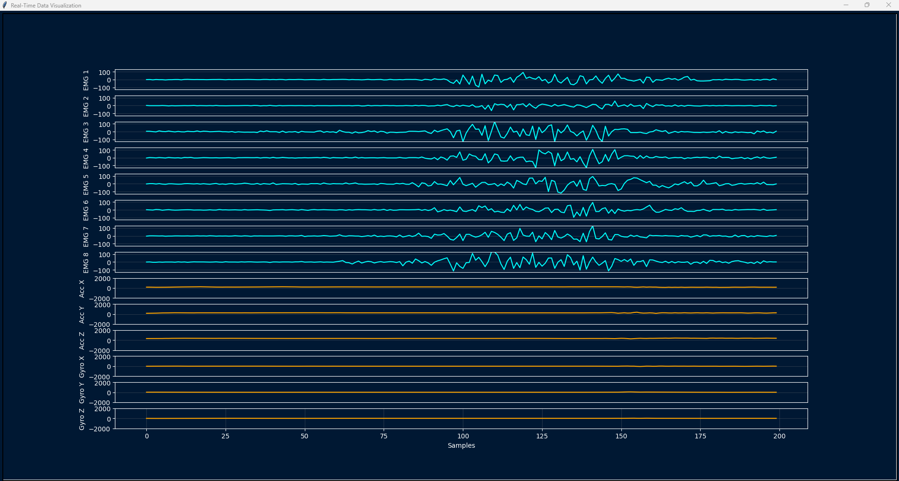

# Evo_Extractor: A Framework for High-Fidelity sEMG Signal Acquisition
**Research Prototype for Neuromuscular Signal Processing and Edge AI**

[](https://www.python.org/)
[]()
[](https://doi.org/10.1109/ICEEIE66203.2025.11252161)

**Principal Developer:** Fazlay Rabby  
**Co-Developer:** Md. Rifat Aknda  
**Affiliation:** Evomed Technology / Department of EEE, ULAB  

---

## 1. Abstract
The **Evo_Extractor** framework addresses a critical limitation in consumer-grade wearable electromyography (EMG) devices: the presence of proprietary, non-deterministic preprocessing artifacts. By bypassing the standard manufacturer SDKs and interfacing directly with the Myo Armband via the Bluetooth Low Energy (BLE) GATT profile, this system facilitates the extraction of raw 8-bit Analog-to-Digital Converter (ADC) values. 

This tool serves as the foundational data pipeline for our research into **Scalable Hand Gesture Recognition**, providing the high-fidelity time-series data required for training hybrid Deep Learning architectures (CNN-BiLSTM-Attention) targeting low-power edge deployment.

---

## 2. Technical Specifications

### 2.1 Signal Acquisition Protocol
* **Sensor Topology:** 8-channel dry electrode surface EMG (sEMG).
* **Data Integrity:** Direct access to raw signed 8-bit integers (Range: -128 to 127).
* **Temporal Resolution:** Sustained 200 Hz sampling frequency per channel, synchronized via Unix epoch timestamps.
* **Communication Layer:** Implemented using the `bleak` asynchronous BLE library for direct characteristic notification handling.

### 2.2 Software Architecture
* **Language:** Python 3.11+
* **Core Dependencies:** `bleak` (BLE communication), `numpy` (signal processing), `matplotlib` (visualization).
* **Deployment:** Standalone executable via PyInstaller for Windows x64.

---

## 🖥️ User Interface Gallery

### 1. Welcome & Setup
The initial screen guides users to perform a scan and establish a handshake protocol with the target BLE peripheral (Myo MAC: `E7:0D:8C:7F:69:84`).


### 2. Main Control Dashboard (Marked)
The primary control dashboard allows for granular hardware orchestration, including dynamic battery telemetry and haptic feedback verification.


### 3. Real-Time EMG Visualization
Crucial for identifying motion artifacts and electrode displacement, providing a live 8-channel stream at 200 Hz.


---

## 3. Research Applications
This framework is currently utilized in the following academic domains:
1.  **Biomedical Signal Processing:** Implementing custom digital filters (Butterworth, Notch) without manufacturer interference.
2.  **Pattern Recognition:** Generating labeled datasets for supervised learning in prosthetic control.
3.  **Human-Computer Interaction (HCI):** Developing low-latency assistive technologies, such as gesture-controlled wheelchairs.

---

## 4. Scholarly Citation

If this framework or the associated data collection methodology is utilized in your research, please cite the following IEEE publication:

**IEEE Format:**
> F. Rabby, R. Das, Md. M. Rahman, Md. H. Hossain, and Md. R. Aknda, "Scalable Hand Gesture Recognition from Surface Electromyography (sEMG) Signals Using a Hybrid Deep Learning Model Evaluated on Diverse Datasets," in *Proc. 2025 9th International Conference On Electrical, Electronics And Information Engineering (ICEEIE)*, Sep. 2025, pp. 1-6, doi: 10.1109/ICEEIE66203.2025.11252161.

**BibTeX:**
```bibtex
@INPROCEEDINGS{11252161,
  author={Rabby, Fazlay and Das, Rajdeep and Rahman, Md. Musfiqur and Hossain, Md. Hridoy and Aknda, Md. Rifat},
  booktitle={2025 9th International Conference On Electrical, Electronics And Information Engineering (ICEEIE)}, 
  title={Scalable Hand Gesture Recognition from Surface Electromyography (sEMG) Signals Using a Hybrid Deep Learning Model Evaluated on Diverse Datasets}, 
  year={2025},
  pages={1-6},
  doi={10.1109/ICEEIE66203.2025.11252161},
  month={Sep.},
}